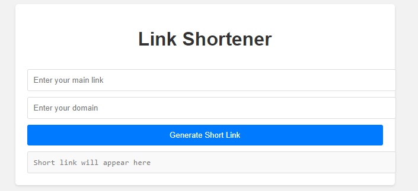
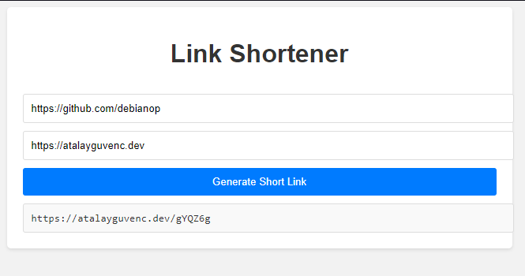

# Link Shortener

A simple link shortener web application built with HTML, CSS, and JavaScript.

## Description

Link Shortener is a web application that allows users to generate short links from long URLs. It helps to make long URLs more manageable and easier to share. This project demonstrates the basic implementation of a link shortening service.

## Features

- User-friendly interface for entering and generating short links.
- Automatic generation of short links using a random string algorithm.
- Copy the generated short link to the clipboard with a single click.

## Demo

You can try out the link shortener application by visiting the [demo link](https://example.com).

## Screenshots

## Installation

1. Clone the repository: `git clone https://github.com/debianop/link-shorter.git`
2. Open the project directory: `cd link-shortener`
3. Launch the application by opening the `index.html` file in your preferred web browser.

## Usage

1. Enter a long URL into the input field.
2. Click the "Generate Short Link" button.
3. The generated short link will appear in the output field.
4. Click the "Copy" button to copy the short link to the clipboard.

## Contributing

Contributions are welcome! If you have any ideas, suggestions, or improvements, please open an issue or submit a pull request.

## License

This project is licensed under the [MIT License](LICENSE).

